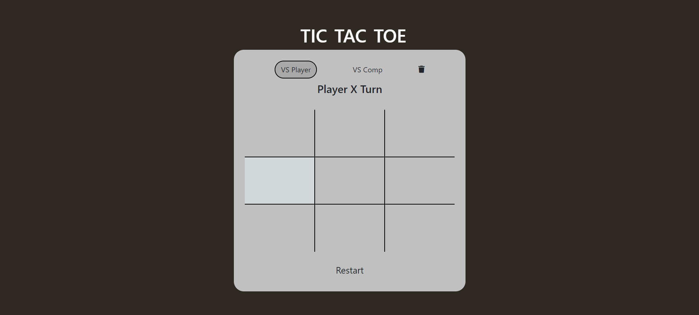
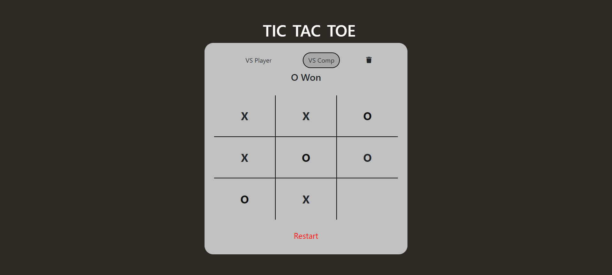

# Tic Tac Toe Game

Welcome to the Tic Tac Toe Game! This is a simple implementation of the classic Tic Tac Toe game using HTML, CSS, and JavaScript. You can play against another user or against the computer.

## Images





## Features

- Play against another user
- Play against the computer with basic AI
- Simple and intuitive interface
- Responsive design

## How to Play

1. Clone the repository to your local machine:

   ```bash
   git clone https://github.com/AakashGaur03/TIc_Tac_Toe
   ```

2. Navigate to the project directory:

   ```bash
   cd TIc_Tac_Toe
   ```

3. Open the `index.html` file in your preferred web browser:

   ```bash
   open index.html
   ```

4. Enjoy the game!
